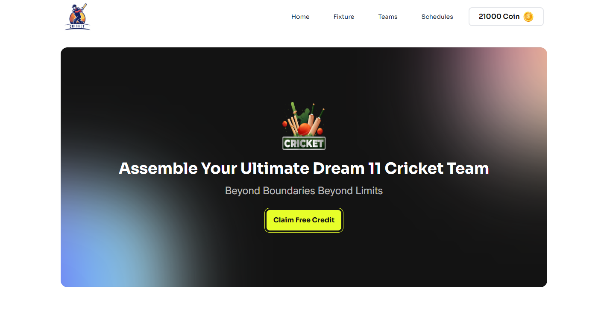

# BPL-Dream-11

- <h2>Project name : BPL-Dream-11</h2>

- 
BPL Dream 11 is a user-friendly fantasy sports platform where users can create personalized teams, view comprehensive player stats, and stay updated on the latest information through a daily newsletter. The site’s responsive design ensures smooth access across devices, with clear team selection guidelines and interactive features tailored for a seamless fantasy team-building experience.

- <h3>3 key features of the project:</h3> 
    <ul>
    <li> User-Friendly Team Selection </li>
    <li> You can buy your favorite team from this platform. </li>
    <li> Daily Newsletter provide</li>
    </ul>
- <h3>Technologies:</h3> 
    <ul>
    <li> HTML5 </li>
    <li> Tailwind CSS </li>
    <li> DaisyUI </li>
    <li> React JS </li>
    </ul>

     

- Live Site URL: https://bpl-dream-11-app.netlify.app/

### Screenshot

